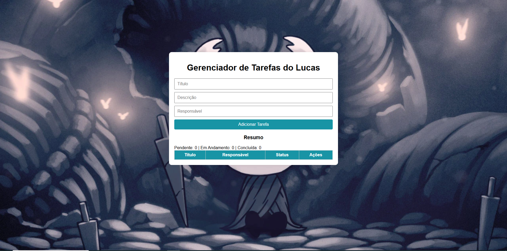

🗂️ **Aplicativo Web de Gerenciamento de Tarefas**:

Uma aplicação web intuitiva e responsiva para organização de tarefas diárias, desenvolvida com foco em usabilidade e performance. O sistema oferece funcionalidades essenciais para o controle de tarefas, com um backend robusto em Node.js, persistência de dados em MySQL via Sequelize ORM, e uma interface limpa construída com HTML e CSS puro.

🔧 Funcionalidades Principais:

✅ Criação Rápida de Tarefas
Permite ao usuário adicionar novas tarefas com agilidade, através de uma interface direta e objetiva.

📋 Listagem de Tarefas
Exibe todas as tarefas cadastradas, com filtros para status (pendente ou concluída).

🔄 Atualização de Status
Possibilita a alteração do estado da tarefa (de "pendente" para "concluída" e vice-versa), com atualização instantânea na interface.

🗑️ Exclusão de Tarefas
Remoção de tarefas concluídas ou desnecessárias, mantendo a organização da lista.

💾 Armazenamento em Banco de Dados Relacional
Utiliza MySQL como mecanismo de persistência, garantindo integridade e confiabilidade dos dados.

📱 Design Responsivo
A interface se adapta automaticamente a diferentes tamanhos de tela, oferecendo uma boa experiência tanto em desktop quanto em dispositivos móveis.

🧰 Tecnologias Utilizadas:

Camada	Tecnologia
Backend	Node.js, Express.js
Banco de Dados	MySQL, Sequelize ORM
Frontend	HTML5, CSS3

🖼️ Interface do Usuário:

---------------------------------------------------------------------------------------------------------------------------------------------------------------------------------------------------------------------------------------------------------------------------

🚀 Como Executar o Projeto Localmente:

Siga as etapas abaixo para executar a aplicação em sua máquina:

1. Clonar o Repositório:
Acesse o terminal.

Clone o repositório com o comando git clone.

Entre na pasta do projeto com cd.

2. Instalar as Dependências:
Execute o comando npm install para instalar todos os pacotes necessários.

3. Configurar o Banco de Dados:
Crie um banco de dados no MySQL (por exemplo: tarefas_db).

Atualize as configurações de acesso no arquivo backend/config/config.json (ou no .env, se estiver usando).

Rode as migrations com o comando npx sequelize db:migrate.

4. Iniciar o Servidor:
No terminal, execute o arquivo backend/server.js com Node.js.

5. Acessar no Navegador:
Abra seu navegador preferido.

Vá até o endereço: http://localhost:3000.

-----------------------------------------------------------------------------------------------------------------------------------------------------------------------------------------------------------------------------------------------------------------------------

📘 Aprendizados Durante o Projeto:

Durante o desenvolvimento, foi realizado um processo completo de transição entre bancos de dados:

- Substituição do SQLite por MySQL.

- Adaptação de models, migrations e conexões com o Sequelize.

- Ganho de familiaridade com conceitos de ORM, migrations, seeders, e relacionamentos entre entidades.

🔍 Conceitos Explorados:

- Implementação de arquitetura MVC simples.

- Integração entre frontend e backend utilizando requisições HTTP RESTful.

- Uso do Sequelize para abstração de operações SQL.

- Tratamento de rotas, middlewares e persistência de dados.

- Validação de entradas e manipulação de erros no servidor.

